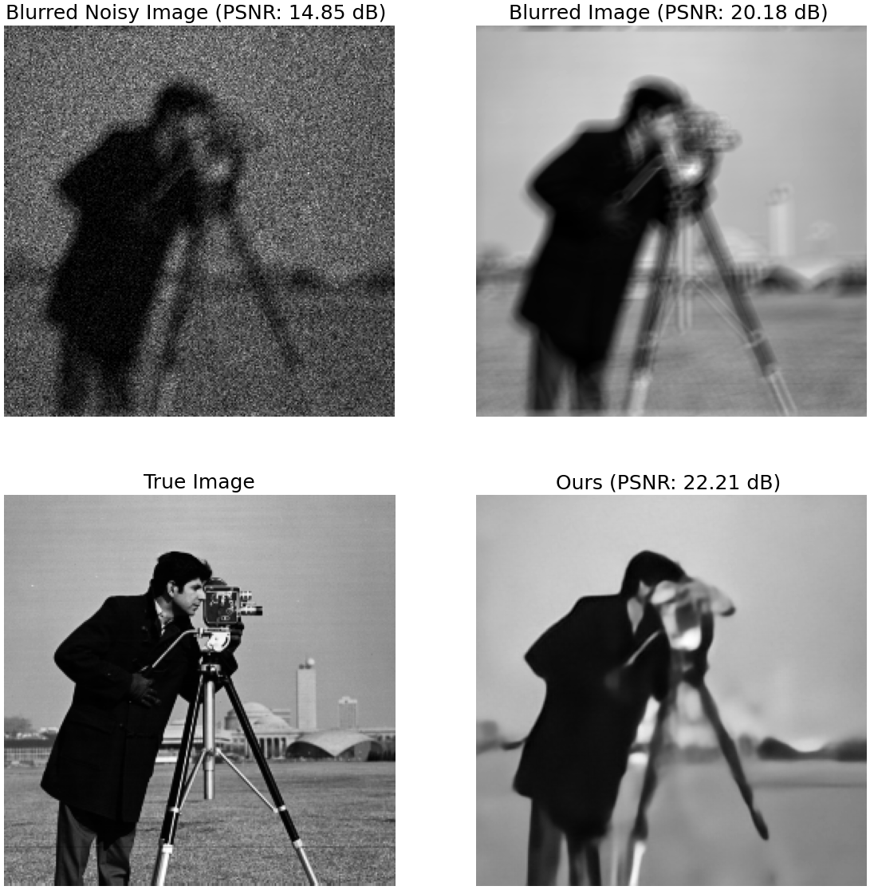
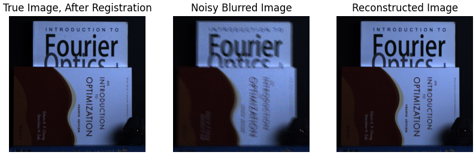

# Photon-Limited Deblurring Dataset
Real world dataset for evaluation of non-blind deblurring algorithms in the presence of photon shot noise. Contains 30 images at different light levels and blurred by different motion kernels - ground truth kernel captured using a point source.

[Download](https://1drv.ms/u/s!AjMYTt_aGQ9-hH_myp4irQREzX3K?e=NwARXc)

## Instructions
1. Create a local copy of repository using the following commands
      ```console
      foor@bar:~$ git clone https://github.com/sanghviyashiitb/poisson-deblurring.git
      foor@bar:~$ cd poisson-deblurring
      foor@bar:~/poisson-deblurring$ 
      
      ```
3. Download the pretrained model into ```model_zoo``` from the link [here](https://1drv.ms/u/s!AjMYTt_aGQ9-hH2aIaReD3DG_ITF)
4. To test the network using synthetic data, run the file
      ```console
      foo@bar:~/poisson-deblurring$ python3 demo_synthetic.py  
      ```
      
      ### Output:
      
    

4. Download the zip file containing [real dataset](https://1drv.ms/u/s!AjMYTt_aGQ9-hH_myp4irQREzX3K?e=NwARXc) into the main directory and unzip using the following command:
      ```console
      foo@bar:~/poisson-deblurring$ unzip real_data.zip -d data/ 
      ```
      
5. To test the network using real data, run the file 
      ```console
      foo@bar:~/poisson-deblurring$ python3 demo_synthetic.py  --idx=11
      ```
      (Variable ```idx``` represents the file index and can be any integer from [0,29] )
      
      ### Output:
      
      

Feel free to ask your questions/share your feedback at sanghviyash95@gmail.com
